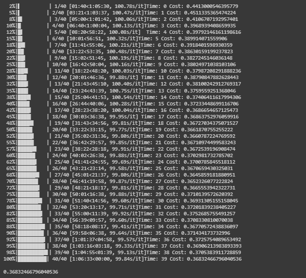
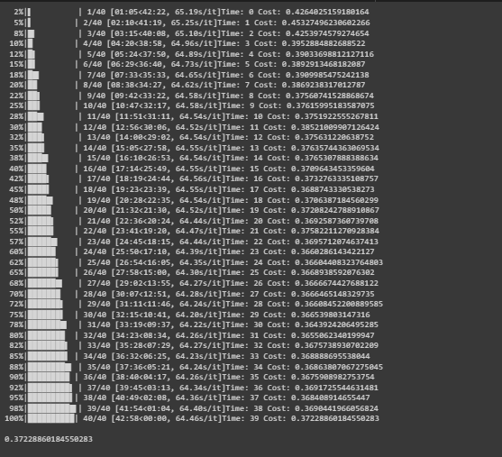

# Attention based Evolving GCN

Attention based Evolving GCN is a novel method for link prediction in temporal graphs. With method described in the paper [EvolveGCN](https://arxiv.org/abs/1902.10191) (Aldo Pareja et al) acting as the base model and integration of attention mechanism (inspired by [GAT]()), the method achieved good performance on various datasets.

## Table of contents

- [Overview](#overview)
- [Datasets](#datasets)
- [Requirements](#requirements)
- [Usage](#usage)
- [Performance](#performance)

## Overview

The model uses EvolveGCN as base model for capturing the dynamism of an evolving graph. The model uses two convolutional layer, one is part of the EvolveGCN (used for feature extraction) and other one for parameter reduction (it convols the input adjacency matrix to lower dimension hence parameters are reduced in successive layers).
To capture the influence of neighbours on a node, the model relies on attention mechanism and calculates attention coefficients for each node using one hop neighbours.

## Datasets

The model was tested on two datasets.
- bitcoin OTC: Downloadable from http://snap.stanford.edu/data/soc-sign-bitcoin-otc.html
- yelp: Downloadable from https://www.yelp.com/dataset/

## Requirements

The script has been tested running under Python 3.8.2, with the following packages installed (along with their dependencies):
- `torch == 1.10.0`
- `sklearn == 1.1.1`
- `tqdm == 4.62.3`
- `torch-sparse == 0.6.12`
- `torch-scatter == 2.0.7`
- `torch-geometric-temporal == 0.34 `
- `torch-geometric == 1.7.1`

## Usage

No special instructions are there for running the model. Just run all the cells of `.ipynb` file sequentially. 

## Performance

For both the datasets, first 40 timesteps were used for training and the next 10 time steps for testing.
- BC-OTC: Cost over different epochs

- Yelp: Cost over different epochs

